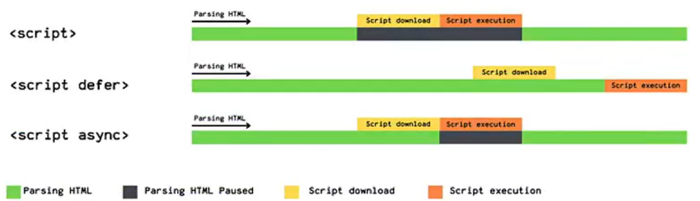
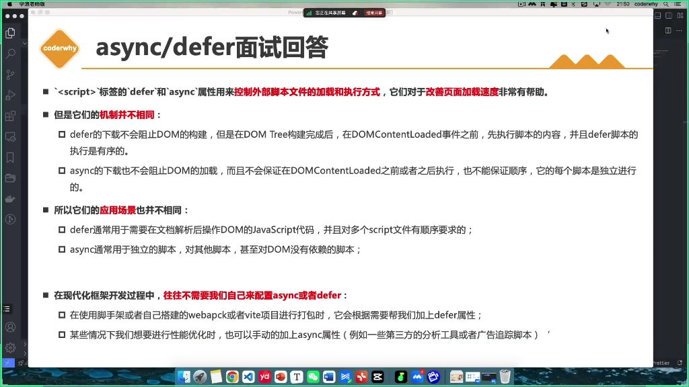

# async 的作用

与 defer 有些类似，让脚本不阻塞页面，但是顺序执行不可控，会在脚本下载好之后立即执行，不能保证 DOMContentLoaded 之前或者之后执行（所以执行会阻塞 domTree 的构建）

async 适合放在 dom 构建后面执行：

```html
<!DOCTYPE html>
<html lang="en">
  <head>
    <meta charset="UTF-8" />
    <meta name="viewport" content="width=device-width, initial-scale=1.0" />
    <title>Document</title>

    <script>
      window.addEventListener("DOMContentLoaded", () => {
        console.log("DOMContentLoaded");
      });
    </script>
  </head>
  <body>
    <div></div>

    <script defer src="./js/defer.js"></script>
  </body>
</html>
```




